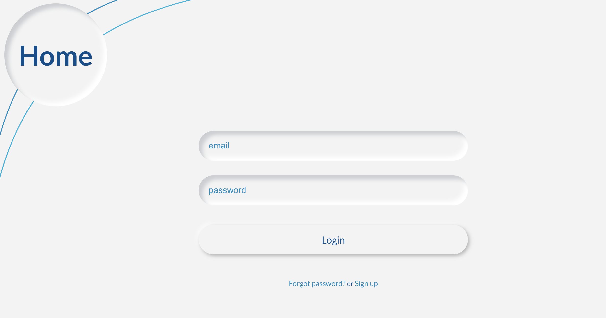

# A login form with neumorphic styling

## What is this?

A reusable login and signup component in React.

## Goal

The main goal was to add neumorphic styling to a login component.
Besides that I have added a (nested) svg element to the header.

## Notes

Inspired by a Red Stapler tutorial.
https://www.youtube.com/watch?v=_mR_dxyajp0
